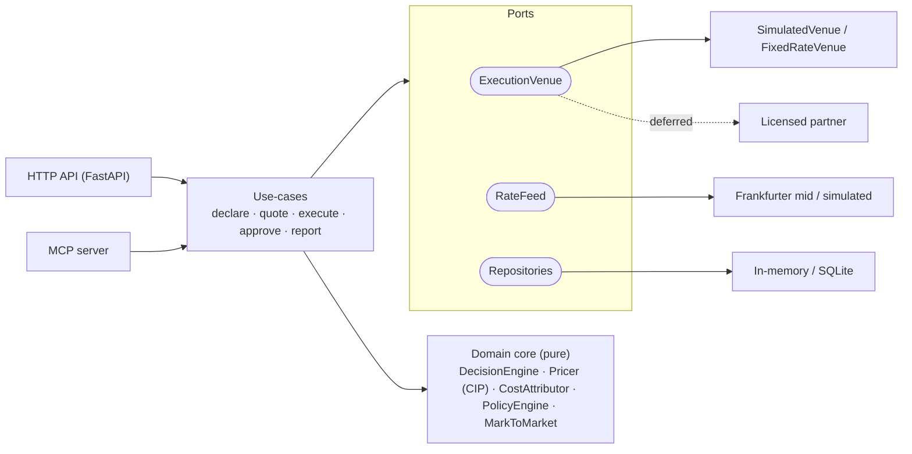

# Numera

**Agent-first FX / hedging micro-execution API.** An agent declares a currency exposure — *"I just
got paid 1,800 USD but my books are in INR"* — and Numera normalizes it, prices it against a **real
mid-market rate**, neutralizes it through a **swappable execution venue** (a simulator now; a
licensed partner later), and returns a **machine-readable fill with complete cost attribution**.

> ⚠️ **No real money moves.** Execution is fully simulated and isolated behind one port
> (`ExecutionVenue`). Going live is a regulated, deferred milestone — see [`docs/PRD.md`](docs/PRD.md) §9.
> Nothing here is legal or financial advice.

## Architecture at a glance

Hexagonal: a **pure domain core** (no I/O) behind **ports**, with swappable **adapters**. One core,
two surfaces (HTTP + MCP); the regulated `ExecutionVenue` is a single, contract-tested seam.



## Documentation
- [`idea.md`](idea.md) — the idea and the regulatory constraint that shapes it
- [`docs/PRD.md`](docs/PRD.md) · [`docs/TRD.md`](docs/TRD.md) · [`docs/ARCHITECTURE.md`](docs/ARCHITECTURE.md)
- [`docs/DECISIONS.md`](docs/DECISIONS.md) (ADRs) · [`docs/GLOSSARY.md`](docs/GLOSSARY.md) · [`plan.md`](plan.md) (phased build plan)

## What's built (Phases 0–5 — complete)
- Exact money math: integer **minor units** + `Decimal`, banker's rounding ([`domain/money.py`](src/numera/domain/money.py)).
- Hexagonal core with ports & adapters; the **`ExecutionVenue` seam** ([`ports.py`](src/numera/ports.py)).
- End-to-end **spot conversion** and **future-dated forward hedge**: declare → quote (TTL) → execute → **attributed fill**.
- **Forward pricing via covered interest-rate parity** with per-currency day-count (ACT/360/365), forward points, value dates ([`domain/services.py`](src/numera/domain/services.py), [`domain/daycount.py`](src/numera/domain/daycount.py)).
- **Both directions**: HAVE (convert what you hold) and OWE (lock the cost of a fixed future obligation).
- **Cost attribution** that reconciles exactly to the all-in cost vs the reference mid (invariant I2), incl. **honest slippage** ([`adapters/slippage.py`](src/numera/adapters/slippage.py)).
- **Server-side risk policy** ([`PolicyEngine`](src/numera/domain/services.py)): per-agent mandates (single-ticket / aggregate net-exposure caps, allowed pairs/instruments), **pre-trade enforcement**, an **approval flow**, and **net-exposure positions**.
- **Mark-to-market** of filled positions (direction-aware unrealized P&L).
- **Queryable append-only audit trail** (any order reconstructable from it), a **double-entry ledger** + **reconciliation** vs the venue, per-agent **reporting**, and **metrics + structured logging** ([`adapters/observability.py`](src/numera/adapters/observability.py)).
- A **venue contract test suite** run against **two** independent `ExecutionVenue` implementations ([`adapters/venue.py`](src/numera/adapters/venue.py), [`adapters/venue_fixed.py`](src/numera/adapters/venue_fixed.py)) — proving a licensed partner drops in behind the seam with no core change.
- **Idempotent** execution; standalone **cost**, **MTM**, **positions**, **audit**, **reconcile**, **report**, and **metrics** endpoints.
- Two surfaces over one core: a typed **HTTP API** *and* an **MCP server** (12 tools) at behavioural parity.
- Real mid-market rates (Frankfurter) or a deterministic simulated feed.

> The repository ports isolate persistence: the build ships with both in-memory repositories and a
> SQLAlchemy/SQLite adapter (no change above the ports).

## Setup

Requires **Python 3.12+**.

```bash
python3.12 -m venv .venv
source .venv/bin/activate
pip install -e ".[dev]"
```

## Run the demo (in-process, simulated)
```bash
python scripts/demo.py                          # simulated rate feed (no network)
NUMERA_RATE_FEED=real python scripts/demo.py    # live mid-market rates
NUMERA_SLIPPAGE_MODE=seeded python scripts/demo.py   # show a non-zero slippage line
```

## Run the HTTP API
```bash
uvicorn numera.adapters.api:app --reload      # OpenAPI docs at http://127.0.0.1:8000/docs
```

Example:
```bash
# Spot: declare a spot exposure -> get a decision
curl -s -X POST localhost:8000/exposures -H 'Content-Type: application/json' \
  -d '{"given":{"amount_minor":180000,"currency":"USD"},"target_currency":"INR",
       "direction":"HAVE","timing":"SPOT"}'
# Forward hedge ("I owe 4,200 EUR, book in USD, settle in 90 days"):
curl -s -X POST localhost:8000/exposures -H 'Content-Type: application/json' \
  -d '{"given":{"amount_minor":420000,"currency":"EUR"},"target_currency":"USD",
       "direction":"OWE","timing":"FORWARD","value_date":"2026-09-15"}'
# Then: POST /quotes {"exposure_id"} ; POST /orders {"quote_id"} with header Idempotency-Key;
#   GET /orders/{id} -> fill + cost_attribution ; GET /orders/{id}/cost -> breakdown alone ;
#   GET /orders/{id}/mtm -> mark-to-market unrealized P&L
# Risk policy: PUT /policies/{agent_id} (set mandate) ; POST /orders/{id}/approve (sign-off) ;
#   GET /positions -> net exposure per currency + aggregate (header X-Agent-Id)
# Audit/ops: GET /audit (filters) ; GET /orders/{id}/reconcile ; GET /report ; GET /metrics
```

## Run the MCP server (agent-native tools)
Exposes the same use-cases as 12 MCP tools (`declare_exposure`, `get_quote`, `execute_hedge`,
`get_order`, `get_cost_breakdown`, `mark_to_market`, `set_policy`, `approve_order`,
`get_position`, `get_audit`, `reconcile_order`, `get_report`) over stdio:
```bash
numera-mcp                              # or: python -m numera.adapters.mcp_server
```

## Persistence
Defaults to in-memory repositories. Flip to durable SQLite (same repository ports, no code change)
— used by `uvicorn`, `numera-mcp`, and `scripts/demo.py`:
```bash
NUMERA_PERSISTENCE=sqlite NUMERA_DATABASE_URL="sqlite:///numera.db" uvicorn numera.adapters.api:app
```

## Test & checks
```bash
pytest            # unit + property (Hypothesis) + HTTP e2e + MCP parity + venue contract + SQLite
mypy              # strict-ish type checks
ruff check .      # lint
```
CI runs all three (plus a demo smoke-test on both backends) on every push — see
[`.github/workflows/ci.yml`](.github/workflows/ci.yml).

## Configuration (env, prefix `NUMERA_`)
`RATE_FEED` (`sim`|`real`), `PERSISTENCE` (`memory`|`sqlite`), `DATABASE_URL`, `PLATFORM_FEE_BPS`,
`VENUE_SPREAD_BPS`, `VENUE_PROVIDER_FEE_BPS`, `QUOTE_TTL_SECONDS`, `SPOT_LAG_DAYS`,
`FRANKFURTER_BASE_URL`, and slippage: `SLIPPAGE_MODE` (`none`|`fixed`|`seeded`), `SLIPPAGE_BPS`,
`SLIPPAGE_SEED`, `SLIPPAGE_MAX_ADVERSE_BPS`, `SLIPPAGE_MAX_FAVORABLE_BPS`. See
[`application/config.py`](src/numera/application/config.py).
