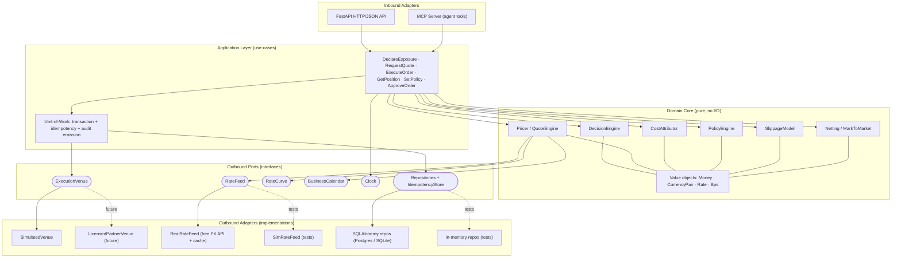
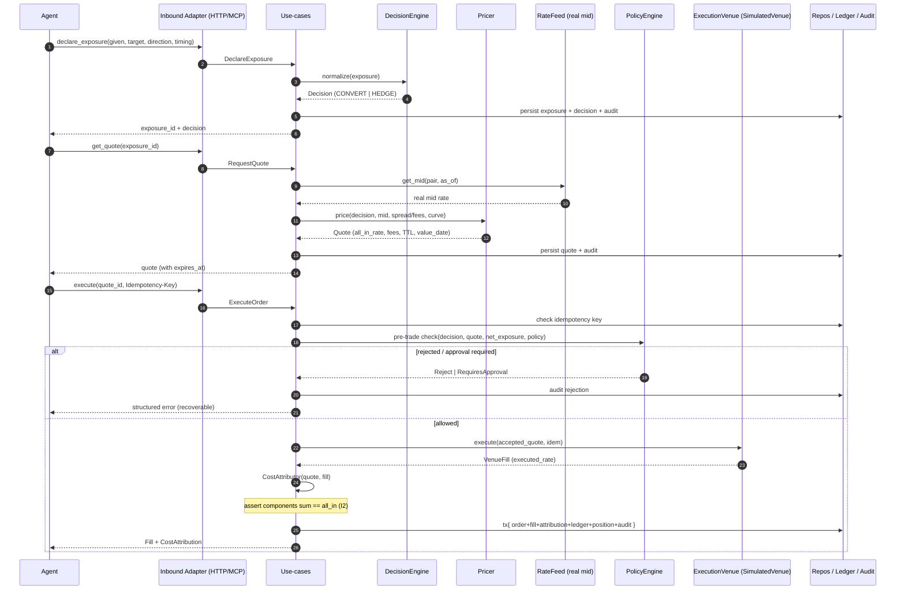
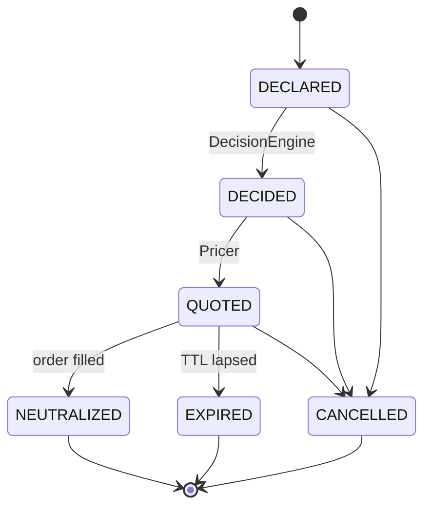
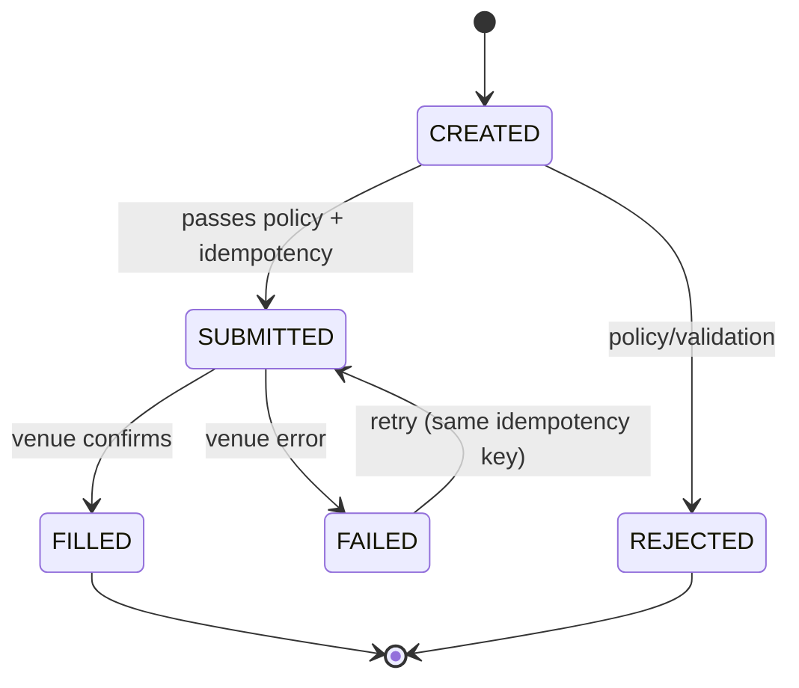
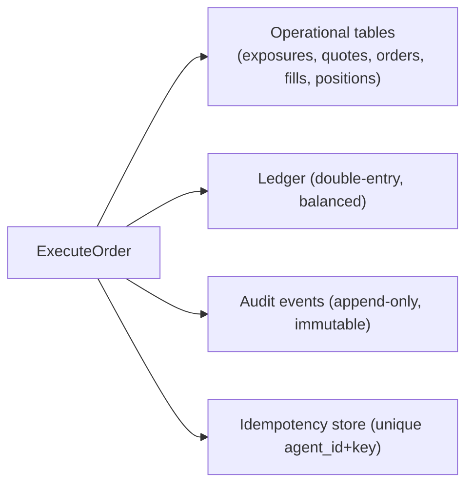
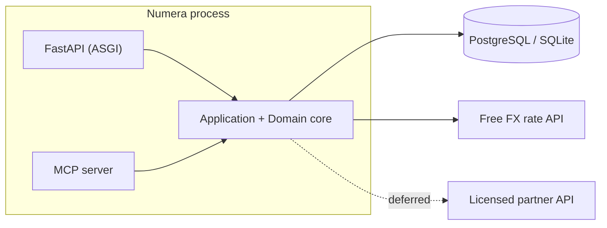

# Numera — Architecture

**Status:** Draft v1 · **Last updated:** 2026-06-15
**Related:** [`PRD`](./PRD.md) · [`TRD`](./TRD.md) · [`DECISIONS`](./DECISIONS.md) · [`GLOSSARY`](./GLOSSARY.md)

> The TRD is the source of truth for the domain model, conventions, and API contracts. This document
> describes **structure, boundaries, and flow** — how the pieces fit and why the venue seam is the
> center of gravity. Diagrams are Mermaid (render on GitHub).

---

## 1. Architectural style: Hexagonal (ports & adapters)

Numera is built as a **hexagon**: a pure **domain core** surrounded by **ports** (interfaces it
depends on), with **adapters** plugged into those ports. The motivation is the PRD's dominant
constraint — execution is regulated, so the place where execution happens (`ExecutionVenue`) must be
a single, swappable boundary. Ports & adapters make "simulate now, drop in a licensed partner later"
a **contained change** (FR-29/30, SM-5, NFR-7) rather than a rewrite.

Layering (dependencies point **inward** only):

```
Inbound adapters (HTTP, MCP)
        │  call
        ▼
Application use-cases (orchestration, transactions, idempotency, audit emission)
        │  depend on
        ▼
Domain core (entities, value objects, pure services)  ← depends on nothing
        ▲  implemented by
        │
Outbound adapters (SimulatedVenue, RealRateFeed, SQLAlchemy repos, …)  via ports
```

The **domain core never imports** FastAPI, MCP, SQLAlchemy, or httpx. It is pure, synchronous, and
fully testable in isolation (NFR-8).

---

## 2. Component overview



**Reading it:** inbound adapters translate requests into use-case calls; use-cases orchestrate pure
domain services and persist through repositories inside one transaction; the only path to execution
is the `ExecutionVenue` port. Real market data enters through `RateFeed`; everything dashed is a
test or future implementation.

---

## 3. The venue seam (center of gravity) — FR-29/30

`ExecutionVenue` is the **single boundary** where regulated execution would occur:

```
ExecutionVenue:
  quote(decision)                 -> VenueQuote      # indicative venue pricing
  execute(accepted_quote, idem)   -> VenueFill       # the regulated act (simulated now)
  status(ref)                     -> VenueStatus     # for reconciliation
```

- **`SimulatedVenue`** (now): returns deterministic-under-seed quotes/fills, applies a configurable
  spread and a `SlippageModel`, moves **no real money** (PRD §9).
- **`LicensedPartnerVenue`** (future, deferred): same interface, real execution via a regulated
  partner's API — added only after legal/partner work (PRD §11).
- **Contract tests** (TRD §11) define the behavior any venue must satisfy; passing them is the proof
  that the swap is contained (SM-5). The core, application layer, HTTP, and MCP are unaffected by
  which venue is wired in.

Everything *above* this seam is the defensible, buildable product; everything *at* it is the
regulated frontier.

---

## 4. Primary flow: declare → quote → execute



All writes in the final step are one transaction (TRD §7); the idempotency check makes a retried
execute return the original result.

---

## 5. State machines





---

## 6. Persistence design

Two complementary stores, both in the transactional DB (TRD §9):

1. **Operational tables** — current state of exposures, quotes, orders, fills, positions, policies.
2. **Event-sourced audit log** (`audit_events`, append-only) — the immutable history; the
   application has no `UPDATE`/`DELETE` rights on it (FR-23/24).
3. **Double-entry ledger** (`ledger_entries`) — balanced debit/credit postings per operation,
   enabling **reconciliation** (FR-25) of internal state vs venue `status()`.



A single **Unit-of-Work** wraps order + fill + attribution + ledger + position + audit in one
transaction (NFR-5). For a future real venue, a **transactional outbox** decouples the DB commit
from the outbound call so the two can't diverge.

---

## 7. Rate feed design (real mid + simulated fills)

- `RealRateFeed` (httpx, async) fetches **real mid-market** rates from a free public FX API.
- **Caching with short TTL** to respect rate limits and bound latency (NFR-4); the cache key is
  `(pair, as_of-bucket)`.
- **Fallback:** on feed failure → last-good cached mid within a freshness window, else a structured
  `VENUE_UNAVAILABLE`-style error; never fabricate a mid silently.
- `SimRateFeed` provides deterministic rates for tests (NFR-8).
- **Spread, fees, and slippage are applied by Numera/the SimulatedVenue**, not the feed — the feed
  only supplies the honest reference mid against which cost is attributed (the product's signature).

---

## 8. Runtime & deployment view

- **One Python service** hosting the application core, exposing **two inbound adapters**:
  the FastAPI app (ASGI, e.g. uvicorn) and the MCP server. Both share the same use-cases, DI
  container, and DB session factory (FR-28).
- **DB:** SQLite locally/tests; PostgreSQL for any shared/demo environment.
- **Config** via environment (`pydantic-settings`): selects venue impl (`sim`), rate-feed impl
  (`real`/`sim`), DB URL, spread/fee parameters, TTLs.
- **Dependency injection:** a composition root wires concrete adapters into ports at startup; tests
  wire in in-memory/sim adapters. No service-locator in the core.



---

## 9. Cross-cutting concerns

- **Correctness:** value objects centralize money math (TRD §2); property tests guard invariants.
- **Idempotency/concurrency:** TRD §7 — unique idempotency keys, optimistic locking, single tx.
- **Observability:** correlation IDs threaded inbound→audit; metrics on latency/slippage/rejections
  (NFR-9).
- **Security:** per-agent API keys → bound mandate; server-side enforcement; no fund custody
  (NFR-6, PRD §9).
- **Determinism for tests:** `Clock`, seeded `SlippageModel`, `SimRateFeed`, in-memory repos.

---

## 10. Architecture Decision Records (summary)

Full log in [`DECISIONS.md`](./DECISIONS.md). Key records:

- **ADR-001 — Hexagonal architecture with an explicit venue seam.** Isolate regulated execution
  behind one port so the simulator→licensed-partner swap is contained.
- **ADR-002 — Simulated venue first; real money deferred.** The defensible build lives above the
  seam; real execution is a separate legal/business milestone.
- **ADR-003 — Python + FastAPI + MCP SDK over one shared core.** Both surfaces are thin adapters;
  behavioral parity enforced by integration tests.
- **ADR-004 — Money as integer minor units + `Decimal`, banker's rounding.** No floats; invariants
  property-tested.
- **ADR-005 — Real mid-market rates, simulated spread/slippage/fills.** Honest cost attribution
  without touching regulated execution.
- **ADR-006 — Forward pricing via covered interest-rate parity.** Structurally honest hedge pricing;
  flat/simulated rate curves in v1 behind a `RateCurve` port.
- **ADR-007 — Append-only audit log + double-entry ledger.** Auditability and reconciliation as
  first-class, non-editable records.
- **ADR-008 — PostgreSQL + SQLAlchemy, SQLite for dev/test.** Transactional exact-decimal storage;
  same repo interface across both.

---

## 11. What a licensed partner would implement (the future swap)

To go live (deferred, PRD §11), a partner integration provides a `LicensedPartnerVenue` adapter
satisfying the `ExecutionVenue` contract tests, plus: real settlement/value-date handling,
counterparty/KYC hooks, and reconciliation against the partner's confirmations. **No change to the
core, application layer, HTTP, or MCP** is expected — that containment is the architecture's primary
success criterion (SM-5).
